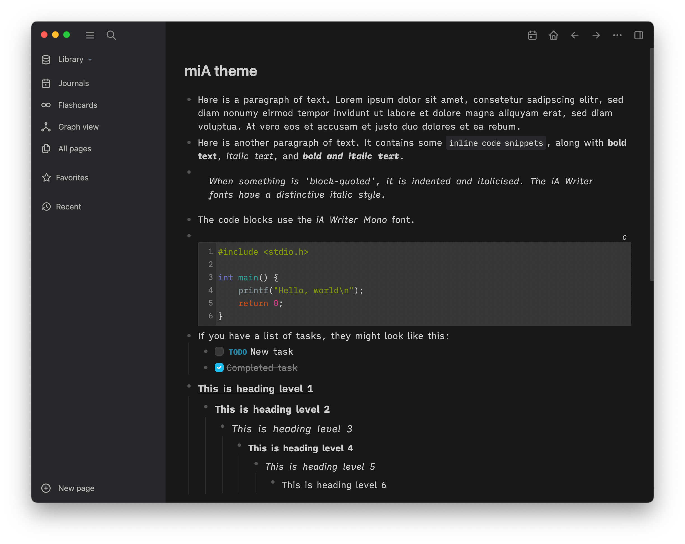

## Logseq miA theme

A [Logseq](https://github.com/logseq/logseq) theme inspired by [macOS](https://www.apple.com/macos/monterey/) and [iA Writer](https://ia.net/writer), supporting light mode and dark mode (configured in Logseq **Settings**), with additional font variations ("duo"-spaced and monospaced).





For user interface elements, the 'system' font is used—[San Francisco](https://developer.apple.com/fonts/) on macOS. User content is rendered using the [iA Writer fonts](https://github.com/iaolo/iA-Fonts). The colour scheme is inspired by *iA Writer* and *macOS*.

The main *miA* theme uses the "iA Writer Quattro" font for content, *miA Duo* uses the "iA Writer Duo" font for content, and *miA Mono* uses the "iA Writer Mono" font for content. All variations use the mono font for code (inline and blocks). The *Duo* and *Mono* variations have small spacing changes, and the heading font sizes are the same as regular text.

### Using the themes

You can install the themes using the *Logseq marketplace* and choose the variation from the **Themes** menu.

Go to **Plugins** from the main menu (click on '...' in top right of the Logseq window ), select **Marketplace** and then **Themes**. Each theme has an 'Install' link.

If you don't see **Plugins** on the main menu, you need to enable plug-ins: go to Logseq **Settings** from the main menu, then the **Advanced** section, and enable the **Plug-in system** and restart Logseq.

If you don't want to use the marketplace, you can add one of the following lines to your `custom.css` page in *Logseq* (you can edit this file using Logseq **Settings**).

To use *miA* (with the "Quattro" font):

```
@import url('https://playerofgames.github.io/logseq-mia-theme/mia.css');
```

To use *miA Duo*:

```
@import url('https://playerofgames.github.io/logseq-mia-theme/mia_duo.css');
```

To use *miA Mono*:

```
@import url('https://playerofgames.github.io/logseq-mia-theme/mia_mono.css');
```

### Tweaks

The following CSS variables are used to produce the different theme variations, shown here with the values for *Duo*:

```
	--content-font-family:  "iA Writer Duo S";
	--content-line-height: 20pt;
	--block-padding: 4px;
	--content-h1-size: 100%;
	--content-h2-size: 100%;
	--content-h3-size: 100%;
```

For example, if you wanted the *Duo* variation to use the standard *Logseq* line-height, you could do:

```
:root {
	--content-line-height: inherit;
}
```

If you like the theme colour scheme, but not the *iA Writer* fonts, you can easily use another font by changing the `--content-font-family` variable.

If you are not on *macOS* and would like the full theme effect of the Logseq user interface using the *San Francisco* font, you can install the "SF Pro Text" and "SF Pro Display" fonts from [here](https://developer.apple.com/fonts/).

### Links

https://github.com/playerofgames/logseq-mia-theme

### Credits

[iA](https://ia.net) for their fonts.

[IBM](https://www.ibm.com/plex/) for their Plex font (which is the genesis of the iA fonts).

[rcvd](https://github.com/rcvd) for their Logseq [Quattro theme](https://github.com/rcvd/logseq-quattro-theme), from which I lifted the embedded font faces for CSS.

Licensed under the MIT License.


